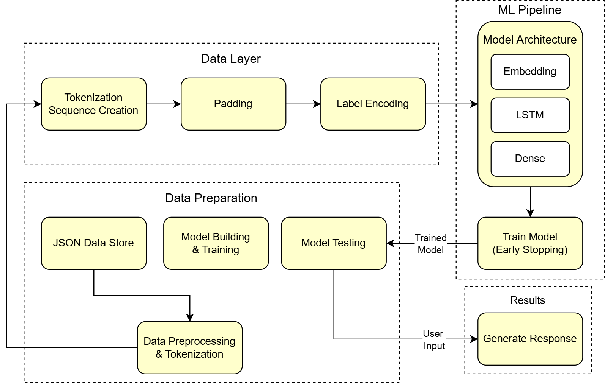

# CareGPT: Mental Health Chatbot

CareGPT is a mental health chatbot designed to support users facing emotional and psychological challenges. It offers intelligent, compassionate conversation powered by machine learning, and helps users monitor their well-being through voice and text interaction.

## Core Capabilities

- **Conversational AI**: Engage in supportive, natural text-based chats with a context-aware AI trained in mental health conversation patterns.
- **Voice Mode**: Users can speak directly to the chatbot, making the experience more personal and accessible.
- **Mood Tracker**: Track your daily mood through simple prompts. Users can view trends and **export mood data as a CSV** for personal insights or therapeutic use.
- **Wellness Resource Hub**: Provides curated mental health resources, coping strategies, and educational content.

## Architecture

## Technical Framework

- **Core Engine**: Python-based backend with advanced NLP capabilities
- **AI Framework**: Custom neural networks built with TensorFlow/Keras
- **Interface**: Streamlit-powered responsive web application
- **Data Management**: Structured JSON architecture with Pandas integration
- **Processing**: NumPy-accelerated computational operations

